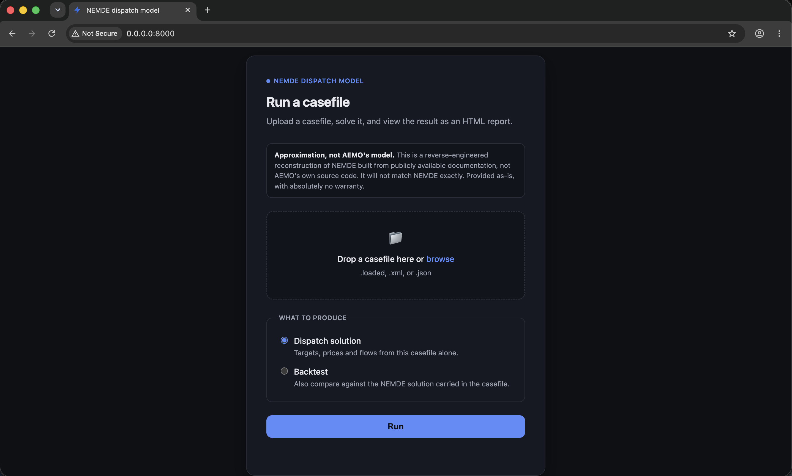
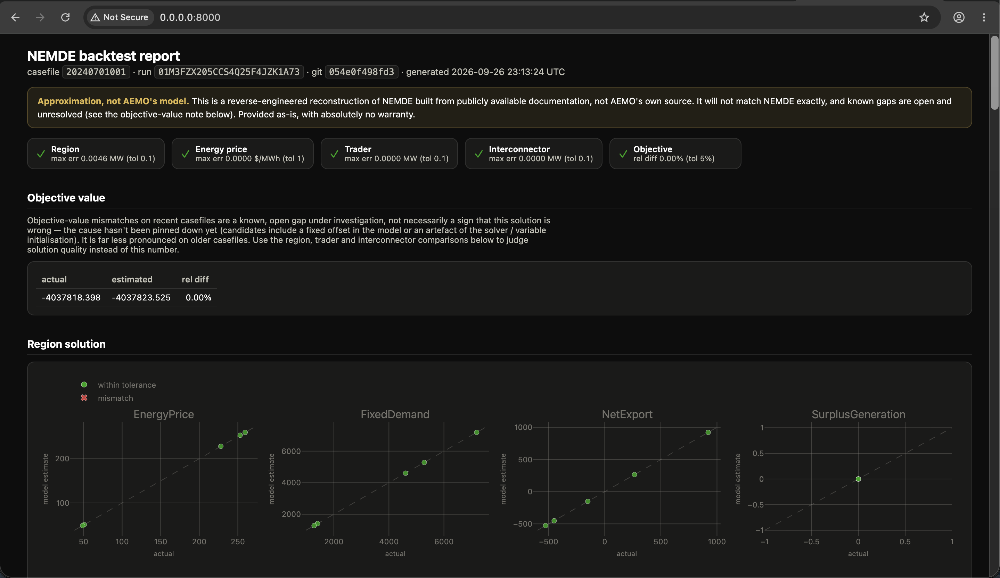
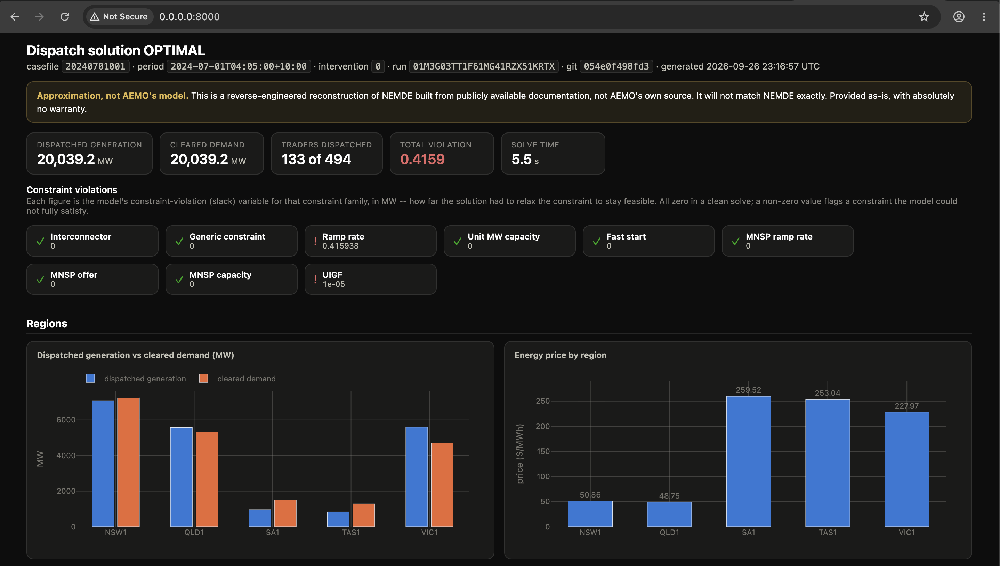

# NEMDE Approximation

An optimisation model that approximates AEMO's NEMDE (National Electricity
Market Dispatch Engine), used to schedule generators/loads and set prices in
Australia's National Electricity Market. Real casefiles go in; dispatch
targets, interconnector flows and regional prices come out, checked against
NEMDE's own published solution for the same interval.

> [!WARNING]
> This is **not** AEMO's model, and it does not have access to AEMO's source
> code or exact formulation. It is a best-effort reconstruction built by
> reading publicly available NEMDE documentation and reverse-engineering
> behaviour from published casefiles. It will not match NEMDE exactly (see the
> backtest gap below), and there is **no warranty of any kind**.

## Quickstart: Docker + browser

The only prerequisite is Docker. The image bundles Python, the model, and the
CBC solver.

From the repository root:

```bash
docker build --build-arg GIT_SHA=$(git rev-parse HEAD) -t nemde .
docker run -p 8000:8000 nemde
```

Open <http://localhost:8000>. Drop in the casefile committed to the repo — `data/input/NemSpdOutputs_20240701_loaded/NEMSPDOutputs_2024070100100.loaded`.



Set to **Backtest**, and click **Run**. The model solves it and an HTML
report renders in place: regional prices and dispatch, interconnector flows,
and a sortable/filterable table of every trader's energy and FCAS targets
next to NEMDE's own published values for the same interval.



Switch mode to **Dispatch solution** to solve and report a casefile on its
own terms, with no NEMDE comparison — the only option once you've edited a
casefile, since NEMDE's published solution then describes a different
problem.



## Using the API

`nemde.api` serves the same model over HTTP; the browser page above is just a
client for it.

| Route | What it does |
|---|---|
| `GET /` | The upload page above. |
| `POST /solve` | Solves the casefile and returns the dispatch solution. |
| `POST /backtest` | Solves the casefile, then compares the result with the NEMDE solution stored in the same file. |

**Sending a casefile.** Put the casefile itself in the request body. Set `Content-Type` to match the body:

- `application/xml` for a `.loaded` or `.xml` casefile, sent as-is (with curl, `--data-binary @FILE`).
- `application/json` for a casefile already converted to JSON with `xmltodict`.

**Choosing the response format.** Send `Accept: text/html` to get an HTML report. Leave it out to get JSON:

- `/solve` returns the solution: prices, flows, and trader targets.
- `/backtest` returns a pass/fail summary.

**Backtest needs NEMDE's answer.** `/backtest` only works on casefiles that still contain NEMDE's published solution (the `NemSpdOutputs` section). If that section is missing, the route returns a 422 error. Use `/solve` for
those casefiles, and for any casefile you have edited.

**Adjusting the pass/fail thresholds.** `/backtest` uses the same defaults
as the CLI. To change them for one request, add query parameters:

| Parameter | Default | Meaning |
|---|---|---|
| `tolerance` | `0.1` | Largest allowed MW error on targets and flows |
| `obj_tolerance` | `0.05` | Largest allowed relative error on the objective (0.05 = 5%) |
| `energy_price_tolerance` | `1.0` | Largest allowed energy price error, in $/MWh |

For example: `POST /backtest?tolerance=0.5&obj_tolerance=0.1`.

```bash
# HTML backtest report
curl -X POST localhost:8000/backtest \
  -H 'Content-Type: application/xml' -H 'Accept: text/html' \
  --data-binary @data/input/NemSpdOutputs_20240701_loaded/NEMSPDOutputs_2024070100100.loaded -o report.html

# Pass/fail summary as JSON
curl -X POST localhost:8000/backtest \
  -H 'Content-Type: application/xml' \
  --data-binary @data/input/NemSpdOutputs_20240701_loaded/NEMSPDOutputs_2024070100100.loaded | jq .passed

# Dispatch solution only, no comparison
curl -X POST localhost:8000/solve \
  -H 'Content-Type: application/xml' \
  --data-binary @data/input/NemSpdOutputs_20240701_loaded/NEMSPDOutputs_2024070100100.loaded -o solution.json

# The same solution as a standalone HTML page
curl -X POST localhost:8000/solve \
  -H 'Content-Type: application/xml' -H 'Accept: text/html' \
  --data-binary @data/input/NemSpdOutputs_20240701_loaded/NEMSPDOutputs_2024070100100.loaded -o solution.html
```

A full casefile takes roughly ten seconds end to end, and the artefacts come
back in the response rather than being written to disk. Reports are stamped with the commit sha, read
from `NEMDE_GIT_SHA` if set (the Docker image bakes this in from the `GIT_SHA` build arg).

## Getting test data: downloading NEMDE casefiles

`data/input/` is gitignored — bulk casefile data isn't checked in. Two
fixtures ship with the repo (force-added past the gitignore, as
minimal test fixtures): `data/input/NemSpdOutputs_20240701_loaded/NEMSPDOutputs_2024070100100.loaded`
and `data/input/NemSpdOutputs_20210101_loaded/NEMSPDOutputs_2021010100100.loaded`.
Those two are enough for the fast test suite and the quickstart above — you
only need more if you're running the solver-backed regression/snapshot
suites or want to explore other intervals.

Casefiles come from AEMO's public NEMWeb archive, one zip per day:

```
https://nemweb.com.au/Data_Archive/Wholesale_Electricity/NEMDE/<YYYY>/NEMDE_<YYYY>_<MM>/NEMDE_Market_Data/NEMDE_Files/NemSpdOutputs_<YYYYMMDD>_loaded.zip
```

e.g. `.../NEMDE_2025_11/.../NemSpdOutputs_20251130_loaded.zip` for
2025-11-30. The zip's 288 `NEMSPDOutputs_<YYYYMMDD><NNN>00.loaded` files (one
per 5-minute dispatch interval that day) sit at its root, so extract into a `NemSpdOutputs_<YYYYMMDD>_loaded/` folder of
your own to get the layout the two committed fixtures use:

```bash
mkdir -p data/input
for date in 20210101 20251130; do
  year=${date:0:4} month=${date:4:2}
  zip="NemSpdOutputs_${date}_loaded.zip"
  curl -o "/tmp/$zip" \
    "https://nemweb.com.au/Data_Archive/Wholesale_Electricity/NEMDE/$year/NEMDE_${year}_${month}/NEMDE_Market_Data/NEMDE_Files/$zip"
  unzip -o "/tmp/$zip" -d "data/input/NemSpdOutputs_${date}_loaded"
done
```

What you need depends on which test suites you're running: `CASES_2021`/
`CASES_2025` in `tests/conftest.py` sample from 2021-01-01 and 2025-11-30
alone, so those two days' zips (the loop above) cover
`test_backtest_regression.py`, `test_refactor_snapshot.py`, and
`test_casefile_solutions.py`. `test_effective_ramp_rates.py` and
`test_fcas_availability.py` glob every interval in November 2025
(`NemSpdOutputs_202511*_loaded`) — the single 2025-11-30 zip above exercises
them on a subset; for exhaustive coverage, loop the same command over every
day in the month (`for day in $(seq -w 1 30); do date=202511$day; ...`).

## Running locally without Docker

Needs [`uv`](https://docs.astral.sh/uv/) and Python 3.11+; `uv run`
resolves and syncs dependencies on first use. You'll also need the CBC solver on `PATH`
(`brew install cbc` on macOS, `apt-get install coinor-cbc` on Debian/Ubuntu).

```bash
# Solve a casefile and compare it against NEMDE's own published solution
uv run nemde-backtest "data/input/NemSpdOutputs_20240701_loaded/NEMSPDOutputs_2024070100100.loaded"

# Solve and report a casefile on its own terms, no NEMDE comparison
uv run nemde-solve "data/input/NemSpdOutputs_20240701_loaded/NEMSPDOutputs_2024070100100.loaded"

# Serve the same API/HTML-UI as the Docker image
uv run --extra api uvicorn nemde.api:app --port 8000
```

`nemde-backtest` writes CSV/HTML artefacts plus a machine-readable
`run_summary.json` into `data/output/<date>/<run>/`; `nemde-solve` writes
`solution_report.html`, `solution.json` and per-entity CSVs into the same
tree. 

## Tests

```bash
uv run pytest tests/test_parsing.py tests/test_fcas_logic.py tests/test_fast_start.py \
  tests/test_solution_report.py
```

These are pure-function tests over the two committed fixture casefiles so they run in a clean
checkout. Every other suite is skipped without `data/input/` (see
[Getting test data](#getting-test-data-downloading-nemde-casefiles) above):
`tests/test_refactor_snapshot.py` (model vs its own recorded output) and
`tests/test_backtest_regression.py --run-regression` (model vs NEMDE) also
need CBC, solve 30 real casefiles each, and take `--quick` to cut that to two
per year for a smoke check. `tests/test_casefile_solutions.py` (precision
check against one 2021 interval, needs CBC) and
`tests/test_effective_ramp_rates.py` / `tests/test_fcas_availability.py`
(field-derivation checks against a month of 2025 casefiles, no solver
needed) round out the data-dependent suites.

## License

MIT — see [LICENSE](LICENSE).